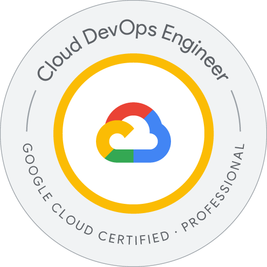

# Hello There

# 📬 Let's Stay in Touch

- Linkedin: [/dogukanturan](https://linkedin.com/in/dogukanturan)
- X: [/imdotu](https://x.com/imdotu)

# ✏️Blog posts
<!-- BLOG-POST-LIST:START -->
- [Helm 101](https://medium.com/devopsturkiye/helm-101-96c3f068cd34?source=rss-91eabe94909d------2)
- [K3D İle K3S Kubernetes Cluster Kurulumu](https://medium.com/devopsturkiye/k3d-i%CC%87le-k3s-kubernetes-cluster-kurulumu-38e71acda9cb?source=rss-91eabe94909d------2)
- [Vagrant ve Kind Kullanarak Kubernetes Cluster Kurulumu](https://medium.com/devopsturkiye/vagrant-ve-kind-kullanarak-kubernetes-cluster-kurulumu-10bbee85eda1?source=rss-91eabe94909d------2)
- [Docker ile Portainer Kurulumu ve Portainer’a Hızlı Bakış](https://medium.com/devopsturkiye/docker-ile-portainer-kurulumu-ve-portainera-h%C4%B1zl%C4%B1-bak%C4%B1%C5%9F-2fdcf2b31deb?source=rss-91eabe94909d------2)
- [Virtualization &lpar;Sanallaştırma&rpar; ve Hypervisor Nedir?](https://devopsguy.medium.com/virtualization-ve-hypervisor-nedir-a1f7acb99765?source=rss-91eabe94909d------2)
<!-- BLOG-POST-LIST:END -->

# 🎯 Certificates

